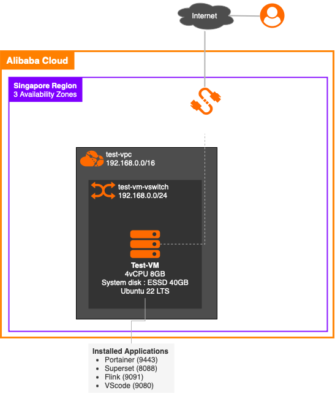

# Data Analytical Lab Setup

This repository provides scripts and resources to build a complete Data Analytical Lab, including:
- **Step 1:** Linux Environment Setup.
- Future components: ClickHouse and a demo application.
<br></br>

### Lab Setup Architecture
  
(To be updated following push progress.)

<br> </br>
<br> </br>
### Step 1. Linux Environment Setup Script


### Requirements
- Recommended Server Spec : 4vCPU 8GB ESSD 40GB (AliCloud ECS) with 10Mbps Elastic IP 
- OS : Ubuntu 22.04 LTS
- Priviledge : Sudo privileges


### How to Use
1. Clone the repository.
   ``` bash
   git clone https://github.com/14Lucifer/PaymentAnalysis.git
   cd PaymentAnalysis/Prepare_Env/
   ```

2. Run the script with sudo.
   ``` bash
   ./ubuntu22_prepare.sh
   ```

3. Follow the on-screen instructions.
   ``` bash
   1. Install Docker and remove conflicting packages.
   2. Set up Portainer for Docker management.
   3. Install Apache Superset for data visualization.
   4. Install Flink for stream processing.
   5. Install VSCode for code editing.
   6. Restart containers to apply changes where necessary.
    
   Do you want to proceed? (yes/no): 
   
   ```


### Installed Packages
| Services   | Description		| Type   | Port          | Credential                  |
|------------| ------------------------ |--------|---------------|-----------------------------|
| Portainer  | Docker Mgmt UI		| Docker | 9443 (HTTPS)  | Setup at initial config     |
| Superset   | Data visualization (BI)	| Docker | 8088 (HTTP)   | admin/admin                 |
| Flink      | Data Streaming		| Docker | 9091 (HTTP)   | No credentials              |
| VScode     | Online Code IDE		| OS     | 9080 (HTTP)   | 8Sw31oCb67                  |


**For Flink SQL**, please access via SQL-Client container:

```bash
cd /PaymentAnalysis/Docker/flink/
docker compose run --build sql-client
```

**For Flink Job submission**, access console of "flink_docker-jobmanager-1" container using Portainer UI.
